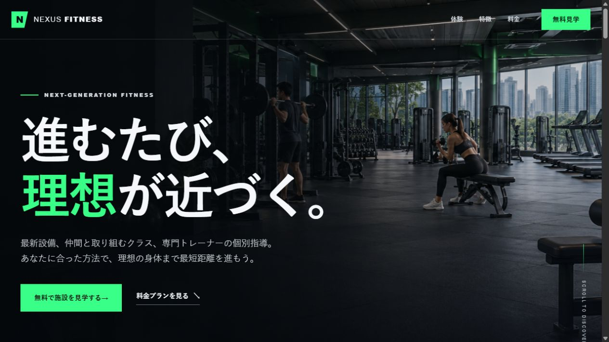
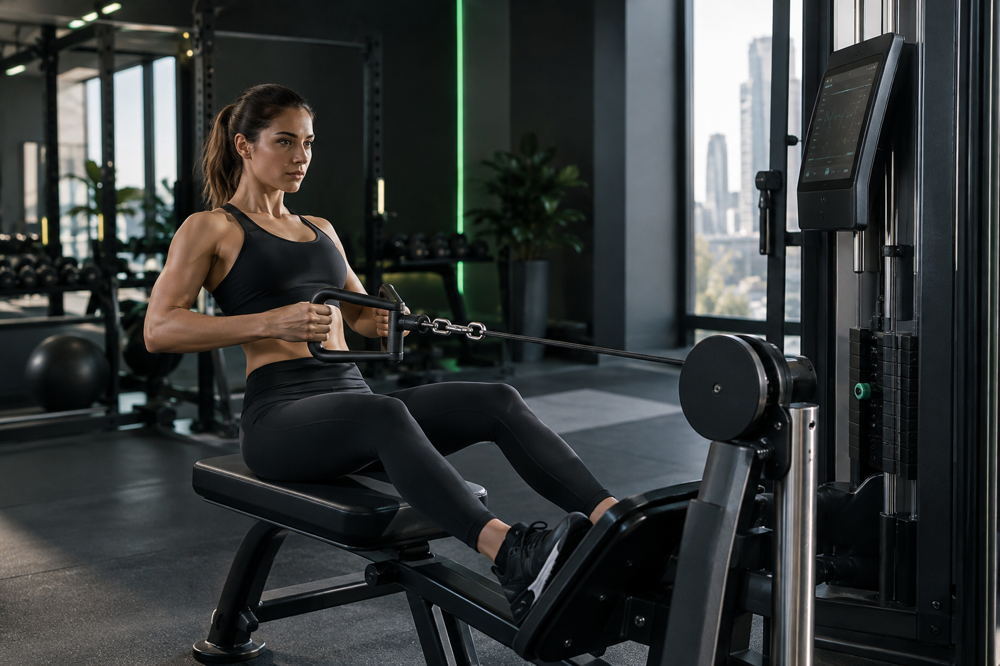
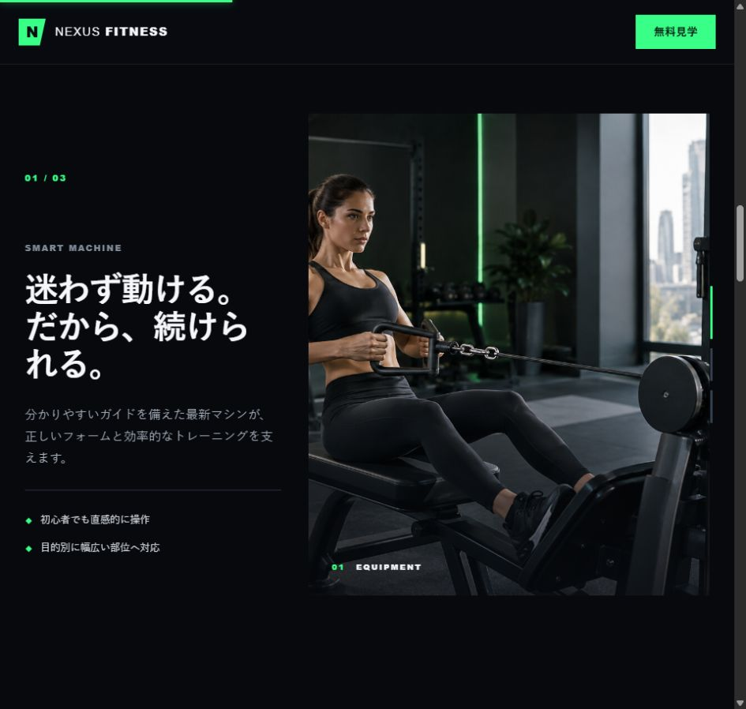

# 第3作目 NEXUS FITNESS STORY LP 制作ウォークスルー



## 1. この作品について

第2作目のフィットネスジムLPを発展させ、スクロール操作そのものを体験の一部として設計したランディングページです。

大きな写真と短いコピーを組み合わせ、ページを進むにつれて「設備」「グループクラス」「個別指導」を順番に理解できる構成にしました。

- **作品名**: NEXUS FITNESS STORY LP
- **コンセプト**: 「スクロールするほど、理想の身体に近づいていく。」
- **目的**: 無料施設見学への申し込みを促す
- **使用技術**: HTML5 / CSS3 / Vanilla JavaScript
- **外部ライブラリ**: なし

> このサイトはWeb制作学習およびポートフォリオ用に制作した架空のサイトです。

## 2. 今回の学習目標

この作品では、静的なレイアウトだけでなく、スクロールに応じて画面が変化する仕組みを学びました。

1. `position: sticky` を使って表示領域を固定する
2. `IntersectionObserver` で要素の表示を検知する
3. `requestAnimationFrame` でスクロール処理をまとめる
4. CSSカスタムプロパティへJavaScriptの値を渡す
5. スマートフォンでは演出を減らし、読みやすさを優先する
6. 動きを抑えたい利用者やJavaScriptが使えない環境にも対応する

## 3. 完成ページの構成

| セクション | 役割 |
|---|---|
| ヘッダー | 主要セクションと無料見学への導線を用意する |
| ヒーロー | コンセプトと先進的な印象を最初に伝える |
| ブランドメッセージ | ジムが提供する価値を短く説明する |
| 設備ストーリー | 3つのトレーニング体験を順番に紹介する |
| 選ばれる理由 | 設備、料金、サポートの強みを整理する |
| 料金プラン | 3プランの違いを比較しやすくする |
| 入会までの流れ | 利用開始までの不安を減らす |
| 最終CTA | 無料施設見学への行動を促す |

## 4. ファイル構成

```text
nexus-fitness-story-lp/
├── index.html
├── README.md
├── SPEC.md
├── WALKTHROUGH.md
├── css/
│   └── style.css
├── js/
│   └── main.js
└── images/
    ├── hero-gym.png
    ├── smart-machine.png
    ├── group-class.png
    ├── personal-training.png
    ├── walkthrough-hero.png
    └── walkthrough-story.png
```

- `index.html`: ページの文章と意味のある構造
- `css/style.css`: 配色、レイアウト、レスポンシブ対応、アニメーション
- `js/main.js`: スクロール進捗、表示検知、設備ストーリーの切り替え
- `SPEC.md`: 制作前に決めた企画と実装方針
- `README.md`: 作品概要と確認方法

## 5. 制作の流れ

### Step 1: 企画を文章にする

コーディング前に `SPEC.md` を作り、ターゲット、ページの目的、掲載内容、配色、演出、アクセシビリティ要件を整理しました。

先に仕様を決めたことで、「派手な動きを付けること」ではなく「設備の違いを順番に理解してもらうこと」を演出の目的にできました。

### Step 2: JavaScriptなしでも読めるHTMLを作る

HTMLには、設備ストーリーの3項目を最初からすべて記述しています。JavaScriptは内容を追加するのではなく、表示方法だけを切り替えます。

```html
<article class="story-step is-active" data-story-step="0">
  <div class="story-copy">
    <p class="story-number">01 / 03</p>
    <h3>迷わず動ける。<br>だから、続けられる。</h3>
  </div>
  <figure class="story-visual">
    
  </figure>
</article>
```

`data-story-step` はJavaScriptから各項目を取得するための目印です。見た目を表すクラス名と役割を分けることで、処理の対象が分かりやすくなります。

### Step 3: 色と基本レイアウトを作る

第2作目と同じブランドだと分かるように、暗い背景と緑のアクセントカラーを引き継ぎました。

```css
:root {
  --bg: #080b10;
  --card: #121821;
  --text: #f5f7fa;
  --muted: #aab3c0;
  --green: #39ff88;
  --border: #29313d;
  --hero-progress: 0;
}
```

色や最大幅をCSSカスタムプロパティにまとめると、ページ全体の調整を一か所から行えます。`--hero-progress` はJavaScriptから更新し、ヒーロー演出にも使用します。

## 6. スクロール演出の仕組み

### 6-1. ページ進捗バー

ページの最上部には、現在のスクロール位置を示す細いバーを配置しました。

```javascript
const maxScroll = document.documentElement.scrollHeight - window.innerHeight;

progressBar.style.transform =
  `scaleX(${maxScroll > 0 ? clamp(scrollY / maxScroll) : 0})`;
```

現在位置をページ全体のスクロール可能距離で割り、`0` から `1` の値へ変換します。その値を `scaleX()` に渡すことで、左から右へ伸びる進捗表示になります。

### 6-2. ヒーロー画像とコピーの変化

ヒーロー内のスクロール量をCSSカスタムプロパティへ渡しています。

```javascript
const heroHeight = hero.offsetHeight;
const heroProgress = heroHeight > 0 ? clamp(scrollY / heroHeight) : 0;
root.style.setProperty('--hero-progress', heroProgress.toFixed(4));
```

CSS側では同じ値を画像の拡大、文章の透明度、位置の変化へ利用します。

```css
.hero-media {
  transform: scale(calc(1 + var(--hero-progress) * .08));
}

.hero-content {
  opacity: calc(1 - var(--hero-progress) * .82);
  transform: translateY(calc(var(--hero-progress) * -54px));
}
```

JavaScriptで多数のスタイルを個別に変更せず、進捗値だけをCSSへ渡す構成にしました。

### 6-3. 固定式の設備ストーリー

PCでは、外側の領域に `300vh` の高さを持たせ、内側の表示領域を `position: sticky` で固定します。

```css
.story-shell {
  position: relative;
  height: 300vh;
}

.story-stage {
  position: sticky;
  top: 0;
  height: 100svh;
  overflow: hidden;
}
```

JavaScriptでセクション内の進捗を計算し、3区間に分けて表示する項目を決めます。

```javascript
const storyProgress = distance > 0 ? clamp(-rect.top / distance) : 0;
const nextIndex = Math.min(
  storySteps.length - 1,
  Math.floor(storyProgress * storySteps.length)
);
```

表示対象が変わったときだけ、本文とインジケーターの `is-active` を切り替えます。

```javascript
storySteps.forEach((step, index) =>
  step.classList.toggle('is-active', index === activeStoryIndex)
);
```



## 7. 要素を順番に表示する仕組み

見出しやカードが表示領域へ入ったことを `IntersectionObserver` で検知します。

```javascript
const observer = new IntersectionObserver((entries, currentObserver) => {
  entries.forEach((entry) => {
    if (!entry.isIntersecting) return;
    entry.target.classList.add('is-visible');
    currentObserver.unobserve(entry.target);
  });
}, {
  threshold: 0.14,
  rootMargin: '0px 0px -7% 0px'
});
```

一度表示した要素は `unobserve()` で監視対象から外します。スクロールするたびに同じアニメーションを繰り返さないため、読みやすく、処理も増えにくい設計です。

## 8. スクロール処理を軽くする工夫

スクロールイベントのたびに直接DOMを更新すると、短時間に処理が何度も実行される可能性があります。そこで `requestAnimationFrame` を使い、ブラウザの描画タイミングに合わせて更新します。

```javascript
const requestScrollUpdate = () => {
  if (frameRequested) return;
  frameRequested = true;
  window.requestAnimationFrame(updateScrollEffects);
};

window.addEventListener('scroll', requestScrollUpdate, { passive: true });
```

- `frameRequested` が `true` の間は重複予約をしない
- `{ passive: true }` でスクロールを妨げない
- 1回の更新で進捗バー、ヘッダー、ヒーロー、設備ストーリーをまとめて処理する

## 9. レスポンシブ対応

PCとスマートフォンでは、見やすい演出が異なります。

### PC

- 設備ストーリーを画面内に固定する
- 文章と写真を2カラムにする
- スクロール位置に応じて3項目を切り替える
- 料金プランを3列で比較する

### スマートフォン

- 固定表示を解除する
- 設備ストーリーの3項目を縦に並べる
- 料金プランを1列にする
- おすすめプランを先に表示する
- ヒーローのボタンを横幅いっぱいにする

```css
@media (max-width: 767px) {
  .story-shell { height: auto; }
  .story-stage { position: static; height: auto; }

  .story-step,
  .js .story-step {
    position: static;
    display: flex;
    opacity: 1;
    visibility: visible;
    flex-direction: column;
  }
}
```

スマートフォンでは複雑な固定演出を残さず、通常のスクロールですべて読める形へ切り替えました。

## 10. アクセシビリティ対応

### 本文へのスキップリンク

キーボード利用者がナビゲーションを飛ばし、本文へ直接移動できるリンクをページ先頭に設置しました。

```html
<a class="skip-link" href="#main">本文へ移動する</a>
```

### 画像の代替テキスト

内容を伝える写真には、写っている人物や設備が分かる `alt` を設定しました。背景として使う装飾画像はCSSで指定し、読み上げ対象から外しています。

### 動きを抑える設定

`prefers-reduced-motion: reduce` が指定されている場合は、スクロール連動の拡大、フェード、固定表示を停止します。

```css
@media (prefers-reduced-motion: reduce) {
  html { scroll-behavior: auto; }
  .hero-media,
  .hero-content {
    transform: none !important;
    opacity: 1 !important;
  }
  .page-progress { display: none; }
  .story-stage { position: static; height: auto; }
}
```

### JavaScriptが使えない場合

`html` 要素には最初に `no-js` クラスを付け、JavaScriptが動いたときだけ `js` へ置き換えます。

```html
<html lang="ja" class="no-js">
<script>document.documentElement.classList.replace('no-js', 'js');</script>
```

JavaScriptが無効な場合は、CSSで進捗バーやインジケーターを隠し、設備ストーリーを通常の縦並びで表示します。機能が使えない場合でも、ページの情報は失われません。

## 11. 制作で工夫した点

### 演出を目的に合わせた

動きを増やすことではなく、3つの体験を一つずつ理解してもらうことを優先しました。スクロール方向を戻した場合も、前の項目へ自然に戻ります。

### HTMLを中心に設計した

必要な情報はHTMLへすべて記述し、CSSとJavaScriptは見せ方を強化する役割に限定しました。これにより、スマートフォン、動きを抑える設定、JavaScript無効時にも同じ内容を読めます。

### 第2作目とのつながりを残した

ブランド名、配色、写真、料金体系を引き継ぎながら、レイアウトと操作体験を変えました。同じ題材でも、目的によって異なる見せ方ができることを確認できました。

## 12. 確認した項目

- [x] PC幅で設備ストーリーが3段階に切り替わる
- [x] 逆方向のスクロールでも前の状態へ戻る
- [x] スマートフォンでは3項目が縦並びになる
- [x] 料金プランが画面幅に応じて1列へ切り替わる
- [x] キーボード操作時にフォーカス位置が分かる
- [x] 動きを抑える設定で大きな演出が停止する
- [x] JavaScriptが使えない場合も全内容を読める
- [x] 画像に代替テキストが設定されている
- [x] 架空サイトであることが明記されている

## 13. 今回学んだこと

1. スクロール演出は、まず `0` から `1` の進捗値へ変換すると考えやすい
2. JavaScriptは状態を決め、見た目はCSSへ任せると整理しやすい
3. `position: sticky` は親要素の高さと表示領域の設計が重要
4. スマートフォンではPCと同じ演出を小さくするだけでなく、構成自体を変える判断も必要
5. アニメーションを使わない環境でも情報が伝わる設計が大切
6. 実装前に仕様書を作ると、演出の目的を見失いにくい

## 14. 今後改善したい点

- 実機でスクロールの滑らかさを追加確認する
- 画像形式と容量を見直し、読み込み時間を短縮する
- 実際のフォームを想定した入力画面を設計する
- Lighthouseなどを使い、表示速度とアクセシビリティを数値でも確認する
- スマートフォン表示のスクリーンショットも追加し、PC表示との違いを比較する

## 15. 関連ファイル

- [完成ページを開く](index.html)
- [作品概要を読む](README.md)
- [企画仕様書を読む](SPEC.md)
- [CSSを確認する](css/style.css)
- [JavaScriptを確認する](js/main.js)

---

第3作目では、HTMLとCSSで情報を確実に伝える土台を作り、その上にJavaScriptでスクロール体験を加えました。動きがある場合もない場合も内容を理解できることを基準に、見た目、処理負荷、アクセシビリティのバランスを取った作品です。
